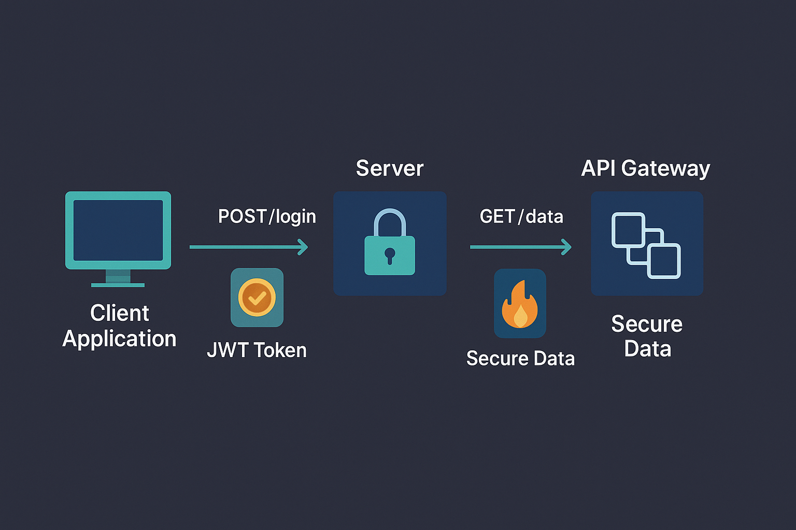

<h1 align="center">
  Enterprise API Auth Service
</h1>

<p align="center">
Node.js REST API backend with JWT auth, RBAC, health checks, and real-time metrics
</p>


<p align="center">
  
</p>


## Key Features

- Rate limiting to prevent brute-force attacks
- Health checks (`/healthz`, `/readyz`) for Kubernetes probes
- OpenAPI (Swagger) documentation at `/docs`
- Prometheus metrics endpoint (`/metrics`) for real-time monitoring
- Full RESTful API with versioning (`/v1/*`, `/v2/*`)
- JWT-based stateless authentication & authorization
- Role-based access control (RBAC) with hierarchical permissions
- Secure password hashing (bcrypt, argon2)
- HTTP-only cookies and token refresh endpoints
- Docker & Docker Compose for one-command local setup
- CI/CD examples (GitHub Actions, Jenkins)


## Quickstart

```bash
cp .env.example .env   # configure MONGO_URI, JWT_SECRET, COOKIE_EXPIRE_DAYS, RATE_LIMIT
docker-compose up --build -d
```

### Authentication Flow

```bash
# Register a user
curl -X POST http://localhost:5000/v1/auth/register \
     -H 'Content-Type: application/json' \
     -d '{"email":"email@example.com","password":"P@ssw0rd"}'

# Login and capture token
TOKEN=$(curl -s -X POST http://localhost:5000/v1/auth/login \
    -H 'Content-Type: application/json' \
    -d '{"email":"email@example.com","password":"P@ssw0rd"}' \
    | jq -r .token)

# Access protected resource
curl -H "Authorization: Bearer $TOKEN" http://localhost:5000/v1/data/profile
```

## Security & Compliance
* Passwords hashed with bcrypt (12+ rounds) or argon2

* JWT signed with 256-bit secret; configurable expiration

* CSRF protection via double-submit cookie

* Rate limiting: default 100 requests/min per IP

* Audit logs for login attempts and role changes

* Data encryption at rest (MongoDB encryption) and in transit (TLS/HTTPS)

## Performance & Monitoring
* Expose Prometheus metrics: response times, error rates, request counts

* Grafana dashboards pre-configured under monitoring/

* Stress-test results: average RPS, 95th-percentile latencies

* Kubernetes HPA sample spec for auto-scaling

## Deployment

### Kubernetes
Helm chart available under charts/ with prod and staging values.

### Docker Compose
```yaml
version: '3.8'
services:
  auth-service:
    build: .
    ports: ['5000:5000']
    env_file: [.env]
  mongo:
    image: mongo:5.0
    volumes: [mongo-data:/data/db]
  prometheus:
    image: prom/prometheus
    volumes: ['./monitoring/prometheus.yml:/etc/prometheus/prometheus.yml']
  grafana:
    image: grafana/grafana
    ports: ['3000:3000']
volumes:
  mongo-data:
```

## Advanced Configuration
* Multi-tenant support via TENANT_ID header parsing

* GraphQL gateway option at /graphql (Apollo Server)

* Dynamic CORS origin whitelist in config.js

* Custom middleware hooks for logging or tracing


## Contributing

* OAuth2 / OpenID Connect support

* Grafana rate-limit dashboards

* Redis token blacklisting store

## License
MIT License © Rodrigo Bravo
